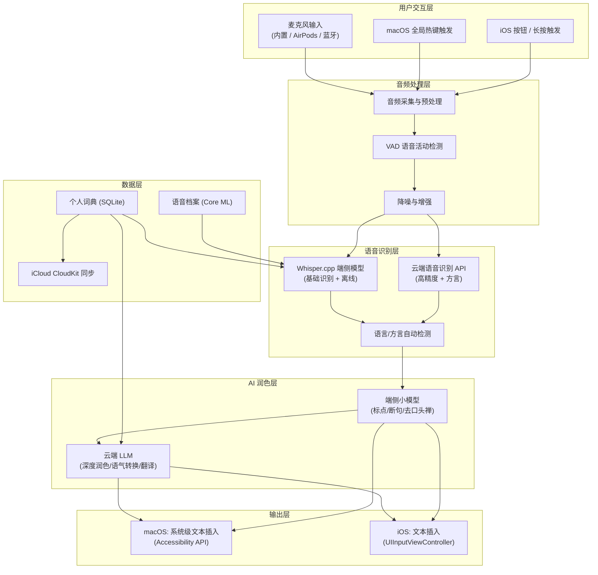

# RunYu（润语）— 产品需求文档 (PRD)

> **版本**: v1.1  
> **日期**: 2026-03-25  
> **产品名称**: RunYu（润语）  
> **品牌理念**: 润物细无声，流畅自然  
> **平台**: macOS / iOS 多端通用  
> **产品类型**: AI 语音输入工具  

---

## 一、产品概述

### 1.1 产品愿景

RunYu（润语）是一款面向 macOS 和 iOS 的 **AI 语音输入工具**，以"润物细无声，流畅自然"为核心理念。用户只需自然说话，RunYu 即可将语音实时转化为高质量的书面文字——自动去除口头禅、修正语法、补充标点、润色表达。让语音输入不再是"语音转文字"，而是"说即成文"。

### 1.2 核心定位

| 维度 | 定位 |
|------|------|
| **产品定义** | AI 语音输入工具（非传统输入法） |
| **核心体验** | 说话 → 自动输出高质量书面文字 |
| **目标市场** | 中文为主 + 多语言混合语音输入 |
| **平台策略** | macOS + iOS 原生开发，全系统级语音输入集成 |
| **核心差异** | 中文语音识别精准 + AI 实时润色 + Apple 生态深度集成 + 隐私优先 |
| **用户画像** | 知识工作者、内容创作者、开发者、多语言用户、无障碍用户 |

### 1.3 产品口号

> **「说即成文，润物无声」**

---

## 二、市场分析与竞品调研

### 2.1 市场规模

| 指标 | 数据 |
|------|------|
| 全球语音识别市场（2025） | $191 亿美元 |
| Voice AI 市场（2025） | $90.5 亿美元 |
| Voice AI 市场 CAGR | 29.3% |
| 移动设备语音转文字市场（2025） | $222 亿美元 |
| AI 语音输入用户日均节省时间 | 47 分钟 |

> [!NOTE]
> 语音输入正在从"辅助输入方式"转变为"主要生产力工具"。Typeless 和 Wispr Flow 等产品已证明该赛道的可行性，但在中文市场尚无同等体验的标杆产品。

### 2.2 核心竞品分析

| 特性 | **Typeless** | **Wispr Flow** | **讯飞语音输入** | **Apple 原生听写** |
|------|-------------|----------------|-----------------|-------------------|
| **产品形态** | 系统级语音输入 | 系统级语音输入 | 输入法内置语音 | 系统级听写 |
| **语音识别** | ⭐⭐⭐⭐⭐ | ⭐⭐⭐⭐⭐ | ⭐⭐⭐⭐⭐ | ⭐⭐⭐ |
| **AI 文本润色** | ✅ 自动润色成书面语 | ✅ AI 指令编辑 | ❌ 纯转写 | ❌ 纯转写 |
| **中文支持** | ⚠️ 弱 | ⚠️ 弱 | ✅ 专业级 | ✅ 基础 |
| **方言识别** | ❌ | ❌ | ✅ 25种方言 | ❌ |
| **多语言** | 100+ 语言 | 100+ 语言 | 30种外语 | 多语言 |
| **延迟** | ~0.8s | 近实时 | 实时 | 实时 |
| **语音指令** | 有限 | ✅ AI Command | ❌ | 基础标点指令 |
| **低语模式** | ❌ | ✅ | ❌ | ❌ |
| **隐私策略** | 零云端留存 | SOC2 + HIPAA | 中等 | Apple 生态 |
| **离线能力** | 有限 | 有限 | ✅ 部分离线 | ✅ 端侧模型 |
| **平台** | macOS + iOS | macOS + Win + iOS | 全平台 | Apple 全平台 |
| **定价** | $144/年 | $144/年 Pro | 免费（含广告） | 免费内置 |

### 2.3 市场机会

> [!IMPORTANT]
> **核心差距**: 当前市场上不存在一款同时满足以下需求的产品：
> 1. **中文语音识别精准** — Typeless/Wispr Flow 中文弱，讯飞无润色
> 2. **AI 自动润色** — 讯飞/Apple 仅做转写，不做口语→书面转化
> 3. **Apple 生态原生** — 讯飞非原生体验，Typeless/Wispr 中文差
> 4. **隐私优先** — 讯飞隐私一般，Typeless/Wispr 中文模型弱
> 5. **方言 + 混合语言** — 说粤语出中文、中英混说自动分辨

**RunYu 的定位**：取 Typeless/Wispr Flow 的 AI 润色能力 + 讯飞的中文语音识别精准度 + Apple 原生的隐私与体验标准，填补这一市场空白。

---

## 三、用户画像

### 3.1 核心用户群

| 用户类型 | 场景 | 核心需求 | 当前痛点 |
|----------|------|----------|----------|
| **知识工作者** | 写邮件、文档、报告、会议纪要 | 快速高质量文字输出 | 打字慢，语音转写质量差需大量修改 |
| **内容创作者** | 写文章、博客、社交文案 | 灵感即时捕捉为成文 | 灵感转瞬即逝，边想边打断思路 |
| **开发者** | 写技术文档、代码注释、Slack 沟通 | 中英混合语音高效输入 | 语音输入不识别技术术语 |
| **多语言用户** | 跨语言沟通（中/英/日/韩/粤） | 说什么语言出什么文字 | 手动切换语言繁琐 |
| **无障碍用户** | 日常所有文字输入 | 用语音完全替代键盘 | 现有语音转写太"口语化"不能直接用 |
| **商务人士** | 走路/开车/碎片时间处理工作 | 移动场景高效输入 | 小屏打字低效、语音转写不够好 |

### 3.2 用户场景故事

**场景 1 — 会议纪要**
> 产品经理 Linda 在 Mac 上开会时，轻按一次快捷键激活 RunYu。她双手自由地记录白板、翻笔记，同时口述要点："接下来这个需求呃大概是两周左右完成吧嗯主要是后端接口和前端页面"。RunYu 持续监听并实时输出：「接下来这个需求预计两周内完成，主要涉及后端接口开发和前端页面制作。」会议结束后说一声"停止录入"即完成。

**场景 2 — 移动创作**
> 作家晨跑时灵感迸发，对着 AirPods 说出想法。RunYu 在 iPhone 上将碎片化的语音沉淀为流畅段落，通过 iCloud 同步后，回到 Mac 时打开备忘录继续编辑。

**场景 3 — 中英混合沟通**
> 开发者 Kevin 在 Slack 里和海外同事沟通："这个 API endpoint 需要加一个 authentication middleware，然后在 response 里返回 user profile 的基本信息"。RunYu 自动识别中英文切换，精准输出混合文本。

**场景 4 — 方言会议**
> 广州办事处的 Tony 用粤语汇报工作，RunYu 将粤语语音转化为标准中文书面语输出。

---

## 四、产品功能架构

### 4.1 功能全景图

```
RunYu（润语）— AI 语音输入工具
│
├── 🎤 核心：AI 语音输入引擎
│   ├── 实时语音识别（语音→文字，延迟 < 1s）
│   ├── AI 实时润色（口语→书面语，自动去口头禅/补标点/分段）
│   ├── 多语言自动检测（中/英/日/韩/粤等，无需手动切换）
│   ├── 方言识别（粤语、四川话、上海话、闽南语等 10+）
│   ├── 中外混合语音（说一句话里混中英文自动分辨）
│   ├── 低语模式（安静环境低声说话也能准确识别）
│   └── 连续长文本输入（不限单次时长，支持持续口述）
│
├── 🧠 AI 增强能力
│   ├── 语音指令编辑（"删除上一句""改成正式语气""加个段落标题"）
│   ├── 语气/风格调节（正式 / 休闲 / 专业 / 友善）
│   ├── 一键润色（对已输出文本进一步润色优化）
│   ├── 即时翻译模式（说中文 → 输出英文，或反向）
│   └── 上下文记忆（理解前文，保持表达一致性）
│
├── 📚 个性化
│   ├── 个人语音档案（学习用户声纹、语速和口音）
│   ├── 个人词典 / 术语库（专有名词、缩写、行业术语）
│   ├── 场景模式（聊天模式 / 正式写作 / 会议纪要等预设）
│   ├── 输出格式偏好（是否自动分段、标题、列表等）
│   └── iCloud 多端同步（设置、词典、语音档案）
│
├── 🔒 隐私与安全
│   ├── 端侧优先（Core ML + Whisper.cpp 本地推理）
│   ├── 云端零数据留存（处理后立即删除）
│   ├── 完全离线模式（牺牲部分润色质量，核心转写可用）
│   ├── 端到端加密传输
│   └── 透明隐私报告（App 内查看数据使用情况）
│
└── 🔌 系统集成
    ├── macOS 全局语音输入（任意文本框可用）
    ├── iOS 全局语音输入（独立 App + 系统级语音扩展）
    ├── 快捷键 / 热键触发
    ├── Shortcuts / 快捷指令集成
    ├── AirPods / 蓝牙耳机集成
    └── 状态栏 / 控制中心快捷入口
```

### 4.2 核心功能详述

#### 4.2.1 🎤 AI 语音输入引擎（P0 — 核心）

| 功能项 | 详细说明 | 优先级 |
|--------|----------|--------|
| **实时语音识别** | 语音→文字延迟 < 1s，支持连续长时间口述（无 6 分钟限制） | P0 |
| **AI 实时润色** | 自动去除口头禅（"嗯""啊""就是"）、修正语法、补充标点、合理分段 | P0 |
| **口语→书面语** | 将口语化表达自动转化为正式书面语，可调节转化程度 | P0 |
| **多语言自动检测** | 说中文出中文、说英文出英文、说日文出日文，无需手动切换 | P0 |
| **中外混合识别** | 一句话中混合中英文（或其他语言）能正确识别并输出 | P0 |
| **方言识别** | 粤语、四川话、上海话、闽南语、东北话、河南话、湖南话、客家话等 10+ 种 | P1 |
| **低语模式** | 在图书馆、开放办公室等安静环境中低声说话也能准确识别 | P1 |
| **说话人自适应** | 持续学习用户声纹、语速和个人口音特征，越用越准 | P2 |
| **噪声抑制** | 咖啡厅、街道等嘈杂环境下有效过滤背景噪声 | P1 |
| **自动断句** | 智能识别停顿，自动判断句子边界、段落边界 | P0 |

#### 4.2.2 🧠 AI 增强能力（P1）

| 功能项 | 详细说明 | 优先级 |
|--------|----------|--------|
| **语音指令编辑** | 自然语言指令："删掉上一句""最后一段改成更正式的""加个标题" | P1 |
| **语气转换** | 对输出文本切换风格：正式 ↔ 休闲 ↔ 专业 ↔ 友善 | P1 |
| **一键润色** | 选中已有文本，一键提升表达质量 | P1 |
| **即时翻译** | 说中文 → 实时输出英文（或反向），支持 30+ 语言对 | P2 |
| **摘要模式** | 长篇口述后自动生成结构化摘要 | P2 |
| **上下文记忆** | 理解前文内容，保持术语、人名、代词引用一致 | P1 |
| **自动格式化** | 根据内容自动生成标题层级、列表、段落结构 | P2 |

#### 4.2.3 📚 个性化引擎（P1）

| 功能项 | 详细说明 | 优先级 |
|--------|----------|--------|
| **个人词典** | 添加专有名词、公司名、人名、缩写、行业术语 | P0 |
| **语音档案** | 通过持续使用学习用户声纹、语速和口音特征 | P1 |
| **场景预设** | 预设模式：日常聊天 / 正式文档 / 会议纪要 / 技术文档 | P1 |
| **输出偏好** | 自定义：是否自动分段、标点风格、简繁体偏好 | P1 |
| **iCloud 同步** | 词典、设置、语音档案跨 macOS/iOS 实时同步 | P0 |

#### 4.2.4 🔒 隐私与安全（P0）

| 功能项 | 详细说明 | 优先级 |
|--------|----------|--------|
| **端侧推理** | 基础语音识别通过 Whisper.cpp + Core ML 在本地完成 | P0 |
| **云端零留存** | 需要云端处理的音频/文本处理后立即删除，不用于模型训练 | P0 |
| **完全离线模式** | 断网也能用：核心转写功能可纯本地运行 | P1 |
| **端到端加密** | 本地与云端传输全程 AES-256 加密 | P0 |
| **透明报告** | 应用内可查看哪些数据被发送到云端、何时删除 | P1 |

---

## 五、技术架构

### 5.1 系统架构概览



### 5.2 技术选型

| 模块 | 技术方案 | 说明 |
|------|----------|------|
| **开发语言** | Swift (主) + C/C++ (音频/模型推理) | Swift 生态 + 高性能计算 |
| **UI 框架** | SwiftUI (主) + AppKit/UIKit (平台适配) | 原生体验，跨平台共享 UI 逻辑 |
| **语音识别（端侧）** | Whisper.cpp (中/英模型) | 离线识别、隐私优先 |
| **语音识别（云端）** | 自建 ASR 服务 或 接入领先 ASR | 中文方言 + 高精度场景 |
| **AI 润色（端侧）** | Core ML + MLX (小模型) | 标点/断句/基础润色 |
| **AI 润色（云端）** | LLM API (大模型) | 深度润色/语气转换/翻译 |
| **音频处理** | AVFoundation + vDSP + RNNoise | 采集/预处理/降噪 |
| **VAD** | WebRTC VAD / Silero VAD | 语音活动检测 |
| **macOS 集成** | Accessibility API + CGEvent | 全局文本插入 |
| **iOS 集成** | 独立 App + Action Extension | 语音输入 + 结果分享 |
| **同步** | CloudKit (iCloud) | Apple 原生同步 |
| **加密** | CryptoKit (AES-256-GCM) | 端到端加密 |

### 5.3 智能路由策略

为平衡质量、速度和隐私，采用智能路由决策：

```
用户语音输入
    │
    ├── 离线模式 → 端侧 Whisper.cpp → 端侧小模型润色 → 输出
    │
    └── 在线模式
        ├── 简单内容（短句/日常对话）→ 端侧处理 → 输出
        └── 复杂内容（长文/方言/深度润色）
            ├── 识别 → 云端 ASR（高精度）
            └── 润色 → 云端 LLM → 输出
```

### 5.4 macOS 应用架构

```
RunYu.app (macOS)
├── 菜单栏常驻图标
│   ├── 语音输入开关
│   ├── 当前模式指示（语言/方言/翻译）
│   └── 快捷设置入口
├── 浮动面板（可选）
│   ├── 实时转写预览
│   ├── 润色前/后对比
│   └── 语音波形可视化
├── 设置窗口
│   ├── 快捷键配置
│   ├── 语言/方言选择
│   ├── 润色强度调节
│   ├── 个人词典管理
│   └── 隐私设置
└── 核心引擎
    ├── 全局热键监听 (CGEvent)
    ├── 音频采集 (AVAudioEngine)
    ├── 语音识别 (Whisper.cpp)
    ├── AI 润色 (Core ML / Cloud LLM)
    └── 文本插入 (Accessibility API)
```

### 5.5 iOS 应用架构

```
RunYu iOS
├── 主 App
│   ├── 独立语音输入界面（一键激活 + 持续监听 + 实时转写）
│   ├── 历史记录（可回溯、复制、分享）
│   ├── 设置与偏好
│   ├── 个人词典管理
│   └── 使用教程
├── Action Extension（系统级分享/调用）
│   ├── 从任意 App 调用 RunYu 进行语音输入
│   ├── 转写结果直接回传到调用 App
│   └── Shortcuts 快捷指令支持
├── Widget 组件
│   ├── 控制中心快捷录音
│   └── 锁屏 Widget 快速入口
└── Shared Container (App Group)
    ├── 词典数据库
    ├── 用户设置
    └── Core ML 模型
```

---

## 六、交互设计

### 6.1 设计原则

| 原则 | 说明 |
|------|------|
| **一键激活** | 单击即激活语音输入，无需长按占用手部 |
| **持续监听** | 激活后持续监听，用户双手完全自由，直到主动停止 |
| **智能停止** | 三种停止方式：再次点击 / 语音指令"停止录入" / 静默超时自动停止 |
| **实时反馈** | 说话时实时看到文字出现，有视觉波形 + 微动画反馈 |
| **无感润色** | 润色自动发生，用户看到的就是成品 |
| **可控输出** | 润色程度用户可调，原文随时可查 |

### 6.2 macOS 交互

- **核心操作**: 轻按一次 `Fn`（或自定义热键）激活语音输入，持续监听无需按住，再按一次或说"停止录入"结束，文字自动插入光标位置
- **浮动预览窗**: 半透明悬浮窗实时显示转写文字（可选关闭）
- **状态栏图标**: 语音激活时图标变绿并有呼吸波形动画，便于远距离确认状态
- **快捷键**:
  - `Fn` (单击切换) — 激活/停止语音输入
  - `⌥ + V` — 激活/停止语音输入（备选快捷键）
  - `⌥ + R` — 对选中文本进行润色
  - `⌥ + T` — 对选中文本进行翻译
  - `⌥ + L` — 切换语言/方言
- **右键菜单集成**: 选中文本后右键 → "用润语润色" / "用润语翻译"

### 6.3 iOS 交互

- **独立 App 模式**: 点击麦克风按钮激活，持续监听并实时转写，双手完全自由；再次点击或说"停止录入"结束，结果可一键复制/分享
- **系统集成模式**: 通过 Shortcuts / Action Extension 在任意 App 中快速调用语音输入
- **AirPods 集成**: 双击/捏合 AirPods 激活语音输入（通过 Shortcuts 配置），全程免拿手机
- **Haptic 反馈**: 激活/停止时有差异化触感反馈（激活=短振，停止=双振）
- **结果编辑**: 转写结果支持点击修改个别词汇，长按查看原始转写
- **锁屏语音**: 支持从锁屏 Widget 直接激活语音输入，完全无需解锁操作手机

---

## 七、商业模式

### 7.1 定价策略

| 版本 | 价格 | 功能范围 |
|------|------|----------|
| **免费版** | ¥0 | 每日 30 分钟语音输入 + 基础润色 + 中英文识别 + 离线基础转写 |
| **Pro 版** | ¥98/年 (¥12/月) | 无限语音输入 + 深度润色 + 语气转换 + 方言识别 + 翻译模式 + 个人语音档案 |
| **团队版** | ¥68/人/年 | Pro 全部功能 + 共享术语库 + 团队管理 |
| **企业版** | 定制报价 | 私有化部署 + 行业术语定制 + API + 合规认证 |

### 7.2 增长飞轮

```
免费版体验（每日 30 分钟，够用一上午的碎片输入）
    ↓ 
体验到 "说即成文" 的效率革命
    ↓
高频使用者触达配额上限 → 自然转化 Pro
    ↓
深度使用产生依赖 → 口碑传播 → 新用户进入
```

---

## 八、发布路线图

### 阶段 1 — MVP (Month 1-3)

> 核心语音→文字体验跑通

| 功能 | 平台 | 说明 |
|------|------|------|
| 实时语音识别（中文 + 英文） | macOS + iOS | Whisper.cpp 端侧模型 |
| 基础 AI 润色（去口头禅 + 加标点 + 断句） | macOS + iOS | 端侧小模型 |
| macOS 全局热键语音输入 | macOS | 单击激活 → 持续监听 → 单击或语音指令停止 |
| iOS 独立 App 语音输入 | iOS | 点击激活 → 持续转写 → 点击或语音停止 |
| 个人词典 | macOS + iOS | 基础术语管理 |
| iCloud 同步 | macOS + iOS | 词典 + 设置同步 |

### 阶段 2 — AI 深化 (Month 4-6)

> AI 润色能力达到 Typeless 水准

| 功能 | 平台 | 说明 |
|------|------|------|
| 云端深度润色 | macOS + iOS | LLM 驱动的口语→书面语 |
| 语气/风格转换 | macOS + iOS | 正式/休闲/专业/友善 |
| 中英混合语音 | macOS + iOS | 混合语句智能分辨 |
| 语音指令编辑 | macOS + iOS | 自然语言指令编辑 |
| iOS Action Extension | iOS | 从任意 App 调用语音输入并回传结果 |
| 上下文记忆 | macOS + iOS | 长文口述保持一致性 |

### 阶段 3 — 体验增强 (Month 7-9)

> 覆盖更多语言和场景

| 功能 | 平台 | 说明 |
|------|------|------|
| 方言识别（粤语/川话/沪语等） | macOS + iOS | 10+ 种方言 |
| 低语模式 | macOS + iOS | 安静环境适用 |
| 即时翻译模式 | macOS + iOS | 说中文出英文 |
| 个人语音档案 | macOS + iOS | 越用越准 |
| 摘要模式 | macOS + iOS | 长文自动摘要 |
| Shortcuts 集成 | macOS + iOS | 自动化工作流 |

### 阶段 4 — 生态扩展 (Month 10-14)

| 功能 | 平台 | 说明 |
|------|------|------|
| API 开放 | 云端 | 第三方开发者接入 |
| 企业版 | 全平台 | 私有化部署 + 合规 |
| Apple Watch 语音速记 | watchOS | 手表快速语音输入 |
| visionOS 支持 | visionOS | 空间计算场景 |
| 会议实时字幕模式 | macOS | 多人会议场景 |

---

## 九、风险与应对

| 风险 | 影响 | 应对策略 |
|------|------|----------|
| **中文语音识别准确率不足** | 核心体验失败 | Whisper 中文专项微调 + 补充国产 ASR 引擎 + 持续 A/B 测试 |
| **AI 润色生成幻觉** | 产出不准确内容 | 保留原始转写可查 + 润色程度可调 + 置信度标记 |
| **云端 AI 成本过高** | 影响利润率 | 端侧优先 + 智能路由 + 简单内容走本地 |
| **Apple 政策限制** | 功能受限 | 紧密关注 WWDC + Accessibility API 作为备选 + Shortcuts 方案互补 |
| **用户隐私顾虑** | 用户不敢用 | 离线模式 + 零留存 + 透明报告 + 独立安全审计 |
| **竞品跟进（Apple 自己做）** | 市场被挤压 | 深耕中文/方言差异化 + 构建用户迁移成本（词典/语音档案） |
| **方言模型训练数据不足** | 方言识别差 | 联合高校/研究机构获取方言语料 + 用户匿名贡献 |

---

## 十、成功指标

### 10.1 产品质量指标

| 指标 | 目标值 |
|------|--------|
| 语音识别准确率（普通话） | ≥ 97% |
| 语音识别准确率（方言） | ≥ 90% |
| 语音→文字延迟 | < 1s |
| AI 润色响应时间 | < 2s |
| 端侧离线识别准确率 | ≥ 92% |
| 噪声环境识别准确率 | ≥ 88% |
| App 崩溃率 | < 0.1% |

### 10.2 业务指标

| 指标 | 6 个月目标 | 12 个月目标 |
|------|-----------|-----------|
| DAU | 10,000 | 100,000 |
| 免费→Pro 转化率 | 5% | 8% |
| 次日留存 | 60% | 70% |
| 7 日留存 | 35% | 45% |
| NPS | 40+ | 50+ |
| 日均语音输入时长/人 | 15 分钟 | 25 分钟 |
| App Store 评分 | ≥ 4.7 | ≥ 4.8 |

---

## 附录

### A. 术语表

| 术语 | 说明 |
|------|------|
| ASR | Automatic Speech Recognition，自动语音识别 |
| VAD | Voice Activity Detection，语音活动检测 |
| Whisper | OpenAI 开源语音识别模型 |
| whisper.cpp | Whisper 的 C/C++ 高性能移植版 |
| Core ML | Apple 端侧机器学习推理框架 |
| MLX | Apple 机器学习研究框架，适合 Apple Silicon |
| LLM | Large Language Model，大语言模型 |
| CloudKit | Apple iCloud 后端服务框架 |
| RNNoise | 基于 RNN 的实时音频降噪库 |
| Silero VAD | 轻量级语音活动检测模型 |

### B. 参考资料

- [Typeless Official](https://typeless.com) — AI 语音听写标杆
- [Wispr Flow Official](https://wisprflow.ai) — AI 语音输入 + 指令编辑
- [OpenAI Whisper](https://github.com/openai/whisper) — 开源语音识别
- [whisper.cpp](https://github.com/ggerganov/whisper.cpp) — Whisper C++ 移植
- [Apple Speech Framework](https://developer.apple.com/documentation/speech)
- [Core ML Documentation](https://developer.apple.com/documentation/coreml)
- [MLX Framework](https://github.com/ml-explore/mlx)
- [RNNoise](https://github.com/xiph/rnnoise) — 实时降噪
